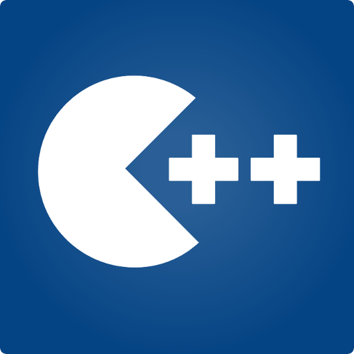

# **C Plus Plus Programming is Fun!**

# **Table of Contents**
* [Chapter 1 - Intro](./ch01_Introduction)
    * [Demo Labs](./ch01_Introduction/Demo_Labs)
    * [Performance Labs](./ch01_Introduction/Performance_Labs)
        * [Performance Lab 1 - GCD and phi](./ch01_Introduction/Performance_Labs/lab1A.cpp)
* [Chapter 2 - C++ Standard Template Library](./ch02_Cpp_STL)
    * [Demo Labs](./ch02_Cpp_STL/Demo_Labs)
        * [Deque](./ch02_Cpp_STL/Demo_Labs/deque.cpp)
        * [Vectors](./ch02_Cpp_STL/Demo_Labs/inputsAndVectors.cpp)
        * [Linked Lists](./ch02_Cpp_STL/Demo_Labs/linked_lists.cpp)
        * [Maps](./ch02_Cpp_STL/Demo_Labs/maps.cpp)
        * [Strings](./ch02_Cpp_STL/Demo_Labs/strings.cpp)
    * [Performance Labs](./ch02_Cpp_STL/Performance_Labs)
        * [Performance Lab 2A - Word Counting](./ch02_Cpp_STL/Performance_Labs/Lab2A/)
        * [Performance Lab 2B - Towers of Hanoi](./ch02_Cpp_STL/Performance_Labs/Lab2B/)
        * [Bonus Lab - Encrypt/Decrypt](./ch02_Cpp_STL/Performance_Labs/bonus_lab/)
* [Chapter 3 - Object Oriented Programming](./ch03_Object_Oriented_Porgramming)
    * [Demo Labs](./ch03_Object_Oriented_Programming/Demo_Labs)
        * [Member Functions](./ch03_Object_Oriented_Programming/Demo_Labs/memberFunctions/)
    * [Performance Labs](./ch03_Object_Oriented_Programming/Performance_Labs)
        * [Lab 3A - Classes and Objects](./ch03_Object_Oriented_Programming/Performance_Labs/Lab3A)
        * [Lab 3B - Mech](././ch03_Object_Oriented_Programming/Performance_Labs/Lab3B)
* [Chapter 4 - Overloading Templates](./ch04_Overloading_Templates)
    * [Demo Labs](./ch04_Overloading_Templates/Demo_Labs)
    * [Performance Labs](./ch04_Overloading_Templates/Performance_Labs)
* [Chapter 5 - Resource Management](./ch05_Resource_Management)
    * [Demo Labs](./ch05_Resource_Management/Demo_Labs)
    * [Performance Labs](./ch05_Resource_Management/Performance_Labs)
